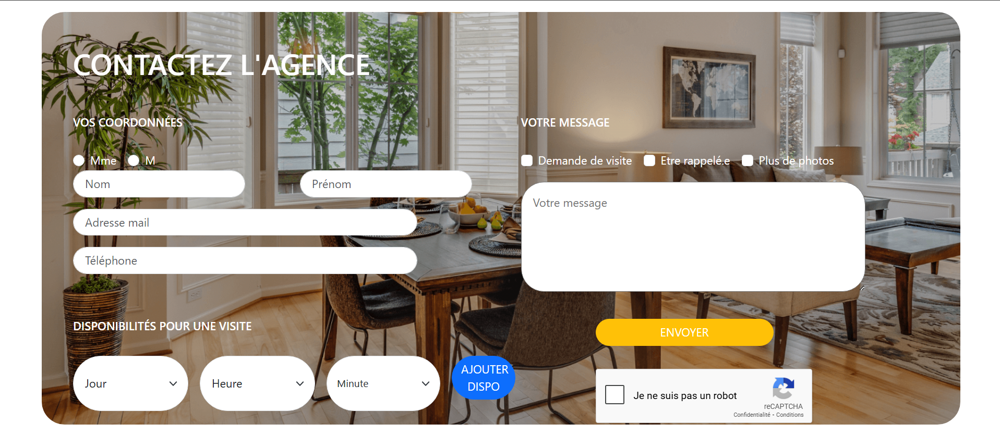

# testMajhordom

## 🚀 Installation

Bonjour, je suis Léann FARANT actuellement en formation au cef. Avant cela, j'ai fait 2 ans au Gaming Campus, ce qui m'a permis 
d'acquérir des bases en développement web. Je suis à la recherche d'un stage de 3 mois afin de valider ma formation puis passer 
l'examen du titre professionnel developpeur web et mobile.

## 📷 Screenshot de la page créée



## ⚙️ Installation

1. Cloner le repo :
   ```terminal
   git clone https://github.com/LeannF/Application-MVC.git

2. Installer les dépendances pour le backend:
    ```terminal
    composer install

3. Installer les dépendances pour le front:
    ```terminal
    npm install
 
4. Créer un fichier .env avec les informations suivantes:
    ```terminal
    DB_HOST=db
    DB_NAME=Test-majhordhom
    DB_USER=root
    DB_PASS=verysecurepassword
    RECAPTCHA_SITE_KEY=6LeQzqsrAAAAAPQP9YP8e70XGFIDIWb9FqIhv1Ro
    RECAPTCHA_SECRET_KEY=6LeQzqsrAAAAAHZfePcaauttJXg62Fpyd5-g6b07

5. Démarer la stack Apache / Mysql / PhpMyAdmin avec docker:
    ``terminal
    docker compose up -d

## 📝 Réponse aux questions 

L'exercice était plutôt simple à première vue, cependant j'ai rencontré des difficultés avec docker car c'est la première fois que je l'utilise, j'ai eu un peu de mal à m'adapter.
J'ai aussi appris à utliser reCAPTCHA qui permet de protéger le formulaire contre le spam ou des bots. Je n'ai pas eu le temps d'utiliser d'autres outils malheureusement.